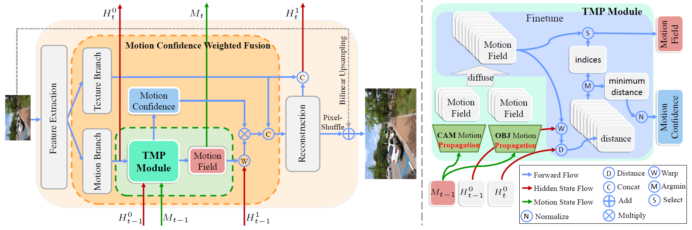

### [TMP: Temporal Motion Propagation for Online Video Super-Resolution](https://arxiv.org/abs/2312.09909)

---

<a href='https://arxiv.org/abs/2312.09909'></a>

[Zhengqiang Zhang](https://scholar.google.com.hk/citations?hl=zh-CN&user=UX26wSMAAAAJ)<sup>1,2</sup> | [Ruihuang Li](https://scholar.google.com.hk/citations?user=8CfyOtQAAAAJ&hl=zh-CN&oi=ao) <sup>1,2</sup> | [Shi Guo](https://scholar.google.com.hk/citations?hl=zh-CN&user=5hsEmuQAAAAJ)<sup>1,2</sup> | [Yang Cao](https://scholar.google.com.hk/citations?hl=zh-CN&user=VuKS1VQAAAAJ)<sup>3</sup> | [Lei Zhang](https://scholar.google.com.hk/citations?hl=zh-CN&user=tAK5l1IAAAAJ)<sup>1,2</sup>

<sup>1</sup>The Hong Kong Polytechnic University, <sup>2</sup> The PolyU-OPPO Joint Innovation Lab,
<sup>3</sup>The Hong Kong University of Science and Technology

## ABSTRACT

Online video super-resolution (online-VSR) highly relies on an effective alignment module to aggregate temporal information, while the strict latency requirement makes accurate and efficient alignment very challenging. Though much progress has been achieved, most of the existing online-VSR methods estimate the motion fields of each frame separately to perform alignment, which is computationally redundant and ignores the fact that the motion fields of adjacent frames are correlated. In this work, we propose an efficient **Temporal Motion Propagation (TMP)** method, which leverages the continuity of motion field to achieve fast pixel-level alignment among consecutive frames. Specifically, we first propagate the offsets from previous frames to the current frame, and then refine them in the neighborhood, which significantly reduces the matching space and speeds up the offset estimation process. Furthermore, to enhance the robustness of alignment, we perform spatial-wise weighting on the warped features, where the positions with more precise offsets are assigned higher importance. Experiments on benchmark datasets demonstrate that the proposed TMP method achieves **leading online-VSR accuracy** as well as **inference speed**. The source code of TMP can be found at [this https URL](https://github.com/xtudbxk/TMP).

## FRAMEWORK
- ##### the illustration of propagation paths for moving objects and static regions


 
The *OBJ path* aims to locate moving objects in the current frame, while the *CAM path* matches the static regions. The <font color=orange>orange</font> arrow represents the estimated motion from I<sup>LR</sup><sub style="margin-left:-1.2%">t−2</sub> to I<sup>LR</sup><sub style="margin-left:-1.2%">t−1</sub>, which starts from the <font color=blue>blue</font> point and ends at the <font color=orange>orange</font> point. The <font color=red>red</font> arrow indicates the temporally propagated motion. In the CAM path, the <font color=green>green</font> point in I<sup>LR</sup><sub  style="margin-left:-1.2%">t&nbsp;&nbsp;</sub> has the same position as the <font color=orange>orange</font> point in I<sup>LR</sup><sub  style="margin-left:-1.2%">t−1</sub>. The <font color=red>red</font> points indicates the potential positions of the object at the corresponding frames, and the brighter colors represent higher likelihood.

---

- ##### the architecture of the proposed online-VSR method


Overview of our proposed online-VSR method. Left: The flowchart of the proposed method. There are two major differences between our method and the existing methods. One is the temporal motion propagation (TMP) module (highlighted in <font color=green>green</font> color box), which propagates the motion field from the previous frame to the current frame. The other is the motion confidence weighted fusion (highlighted in <font color=orange>orange</font> color box), which weighs the warped features by the accuracy of estimated offsets. Right: The detailed architecture of the TMP module. Best viewed in color.

<div style="display:none">
- ##### the TMP algorithm


*please refer to the [paper](https://arxiv.org/abs/2312.09909) for the details of each equations. *
</div>

## HOW TO USE

- ##### Prerequisite
  We train and test our project under torch==1.10 and python3.7. You can install the required libs with `pip3 install requirement.txt`.
  
- ##### Dataset
  Please refer to [here](https://github.com/xinntao/EDVR/blob/master/docs/Datasets.md) to download the *REDS*, *Vimeo90K*  dataset and [there](https://mmagic.readthedocs.io/en/stable/dataset_zoo/vid4.html) for*Vid4* dataset.
  
- ##### Train
  You can train this project using `python3 basicsr/train.py -opt options/train/TMP/train_TMP.yaml`.
  
- ##### Test
  You can test the trained models using `python3 basicsr/train.py -opt options/test/TMP/test_TMP.yaml`.
  
- ##### Pretrained Models
  Please download the pretrained models from [OneDrive](https://connectpolyu-my.sharepoint.com/:u:/g/personal/22040257r_connect_polyu_hk/Eabm8iorllFBpZm7JU4DED0BFgDUqcA8IUBJ_nYfh62G2A?e=7JnYap)).

*please modify the paths of dataset and the trained model in the corresponding config file mannually*

## RESULTS

*please refer to the [paper](https://arxiv.org/abs/2312.09909) for more results.*
   
- ##### Compared with non- and online-VSR methods


- ##### Visualized Results on Static Regions and Moving Objects


- ##### Visualized Results on REDS4


## CITATION

```
@misc{zhang2023tmp,
    title={TMP: Temporal Motion Propagation for Online Video Super-Resolution},
    author={Zhengqiang Zhang and Ruihuang Li and Shi Guo and Yang Cao and Lei Zhang},
    year={2023},
    eprint={2312.09909},
    archivePrefix={arXiv},
    primaryClass={cs.CV}
}
```

### CONTACT

Please leave a issue or contact zhengqiang with [zhengqiang.zhang@connect.polyu.hk](mailto:zhengqiang.zhang@connect.polyu.hk)

## License and Acknowledgement
Great thanks to [BasicSR](https://github.com/XPixelGroup/BasicSR). We build our project based on their codes. Specially, we implement the cuda version for TMP and corresponding network architectures. Please refere to `basicsr/archs/tmp*` for more details.

This project is released under the [Apache 2.0 license](https://www.apache.org/licenses/LICENSE-2.0.html).

please refer to [BasicSR's LICENCE.md](LICENCE/README.md) for more details of licence about the code in BasicSR.
